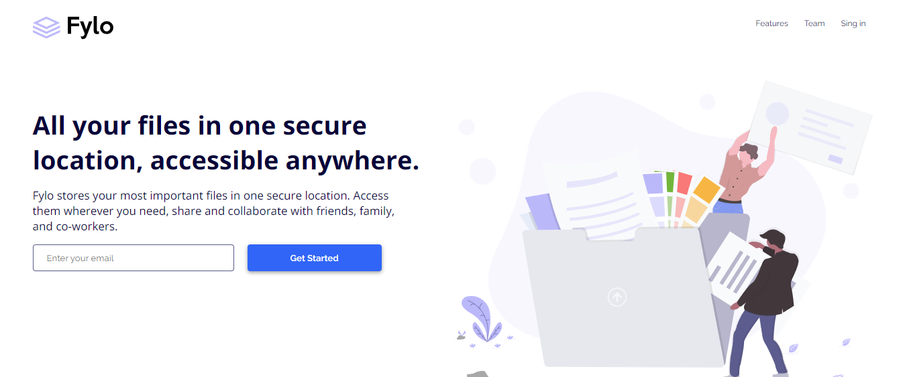

## Welcome! 👋

This is a solution to the [Fylo landing page with two column layout challenge on Frontend Mentor](https://www.frontendmentor.io/challenges/fylo-landing-page-with-two-column-layout-5ca5ef041e82137ec91a50f5).
## Table of contents

- [Overview](#overview)
  - [Screenshot](#screenshot)
  - [Links](#links)
- [My process](#my-process)
  - [Built with](#built-with)
  - [What I learned](#what-i-learned)
  - [Continued development](#continued-development)
- [Author](#author)

**Note: Delete this note and update the table of contents based on what sections you keep.**

## Overview

### The challenge

Users should be able to:

- View the optimal layout for the site depending on their device's screen size
- See hover states for all interactive elements on the page

### Screenshot

### Links

- Live Site URL: [live site here](https://jordy01090.github.io/Fylo-landing-page/)

## My process

### Built with

- Semantic HTML5 markup
- CSS custom properties
- Flexbox
- CSS Grid
- Mobile-first workflow

### What I learned

In this challenge i've learn how to make a good responsive design, the correct use and structure of the html, the correct structure of the css too, i've learn how to position the elements in a single page, it was an excellent practice to me.

### Continued development

Now, i wanna learn about javascript, i think this is the next step that i need actually, so that will be my next focus.

## Author

- LinkdIn - [Jordy Avila](https://www.linkedin.com/in/jordy-avila-706852251/)
- GitHub - [Jordy Avila](https://github.com/Jordy01090)
- Frontend Mentor - [Jordy Avila](https://www.frontendmentor.io/profile/Jordy01090)

